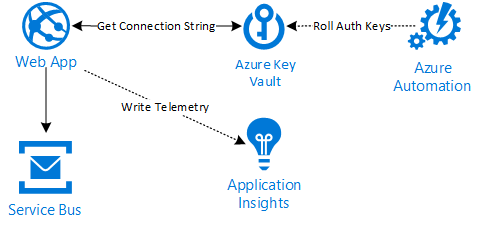

# In-Memory Caching with automatic Service Bus authentication key rolling

Demo on how you can use in-memory caching to avoid hitting Azure Key Vault every time. It is also aware when an authentication key has been revoked and automatically gets the latest secret from Key Vault.

- `/api/v1/orders` - Will queue a message on a Service Bus Queue
    - Will retrieve Service Bus connection string for specific auth policy from Key Vault
    - Secret will be stored in-memory and metrics provide insights in cache hit/miss ratio
- Azure Automation is automatically rolling the authentication keys every day by running `scripts/Rotate-ServiceBusKeys.ps1`

